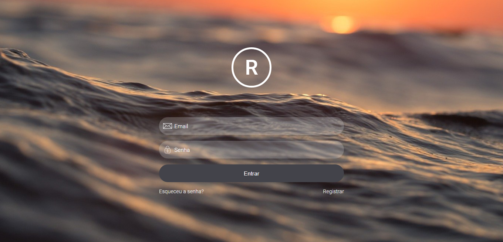

<h1 align="center">Tela de Login</h1>

Uma tela de login resposiva com verificação de email básica

Sumário
===========
<!--ts-->
  * [Sobre](#sobre)
  * [Screenshot](#screenshot)
  * [Como usar](#como-usar)
  * [Status](#status)
  * [Tecnologias](#tecnologias)
  * [Autor](#autor)
<!--te-->

Sobre
-----

Este projeto foi feito com o inuito de exibir em meu portfólio, minhas habilidades em criar telas usando HTML e CSS

Screenshot
----------

Como Usar
---------

Você pode acessar o site clicando <a href="https://login-screen-beta.vercel.app/">aqui</a> ou abrindo o arquivo HTML em um navegador.

O site não possui muitas interções, as principais são quando o usuário clica ou digita nos campos as etiquetas "email" e "senha" sobem, dando espaço para o usuário digitar mas ainda informando o dado que o usuário deve informar.

Também possui uma pequena verificação de email, enquanto o usuário digita o JavaScript analisa se o email é um email válido ou não. Quando o email não é válido a borda do campo fica vermelha.

Status
------
Concluído :heavy_check_mark:

Tecnologias
-----------

  
  
  

Autor
------
<h3 align="center">Rafael Tavares</h3>

 <a href="https://www.facebook.com/rafael.tavares.39904/"></img></a>
 <a href="https://www.instagram.com/rafatavares03/"></img></a>
 

